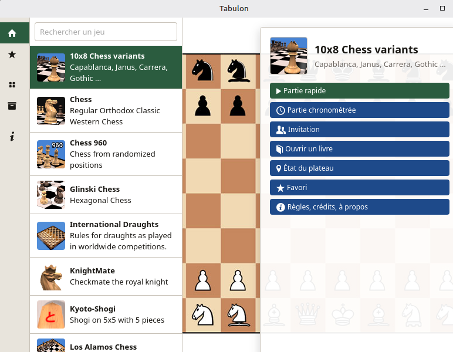
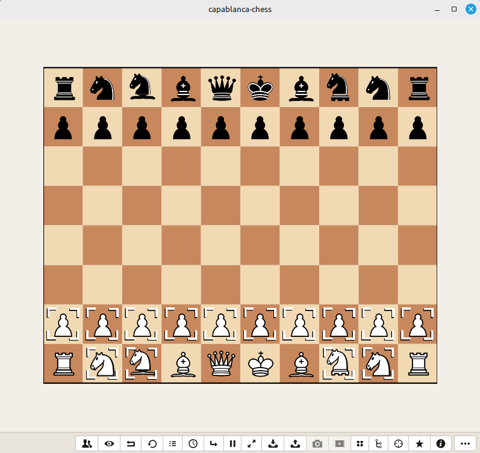

# Tabulon

Play **125 board games** on your desktop — chess and its many variants, draughts, shogi, xiangqi, go-style territory games, mills, tafl, and more. Tabulon is a free, cross-platform application (Linux, Windows, macOS) built on the [Jocly](https://fhoudebert.github.io/jocly2) game library, as a [Tauri 2](https://v2.tauri.app) inspired by the abandonned JoclyBoard.

## What you can do

- **Play in 2D or 3D** — every game offers switchable views, with rotatable, zoomable 3D boards.
- **Play against the computer** — several AI levels per game, or watch two AIs play each other.
- **Play against a friend** — on the same machine, or **online** (see below).
- **Learn as you go** — each game ships its own illustrated rules page (English/French where available).
- **Take your time, or race the clock** — configurable game clocks, move history with takeback and replay, and rollback to any earlier position.
- **Save and resume** — save games to files, reload them later, save favorite setups as templates, and mark favorite games for quick access.
- **Capture your games** — record a video of the board or take 3D screenshots, right from the app.
- **Open as many boards as you like** — every game runs in its own window; satellite windows (history, clock, players, possible moves…) follow the one you're playing.
- **Use it in English or French** — the interface follows your system language.

## Getting started

**You can get ready-to-use, pre-compiled versions of Tabulon available for Windows and Linux** on the [Releases page](https://github.com/fhoudebert/tabulon/releases). Download the package for your platform, install (or unpack) it, and launch — Tabulon works out of the box with a starter selection of built-in games. (Prefer building from source? See [DEVELOPMENT.md](DEVELOPMENT.md).)

These pre-built versions are not fixed: the game library of any installed Tabulon can be **customized** — up to the **full 125-game library** — in two ways:

1. **Install extensions (add or remove games)** — the easiest way. Open the **Extensions** screen (hub sidebar, Configuration group) and import downloaded `.tabulon-ext` files. Browse the catalogue:

   - [Modules](https://fhoudebert.github.io/tabulon/ext/modules/index.html) — whole game families (a *module* bundles related games and their shared resources; import it with no prerequisite)
   - [Games](https://fhoudebert.github.io/tabulon/ext/games/index.html) — individual games (importing a game requires its module to be installed first)

   The "Get extensions…" link in the Extensions screen takes you straight there. Extensions can also be **uninstalled** from the same screen, so you can add and remove games at any time.

2. **Replace the game library with a published Jocly `dist`** — ready-made `dist` builds are published on the [jocly2 releases page](https://github.com/fhoudebert/jocly2/releases/). Download one and place the complete Jocly `dist/` folder beside the Tabulon executable (or point the `TABULON_DIST` environment variable at it) — no rebuild, no reinstall: Tabulon picks it up at launch.

## Playing online

Two ways to play against a remote human, both from the **Players** window of any game:

- **Through a relay server** — create or join a match on a shared relay (compatible with existing [joclymatch](https://github.com/fhoudebert/joclymatch) servers). An **invitation screen** lets you create a game and hand the match link to your opponent, or join one you received. You can even play against someone using the original jocly-simple-match web page.
- **Peer-to-peer, no server at all** — one player hosts and gets a short **connection code**; the other pastes it and the game connects directly between the two machines. Works on a LAN out of the box; across the internet, the host opens a port (or uses any port-forwarding/VPN setup) and can embed the public address in the code. No account, no third party, nothing stored anywhere.

Both modes are marked **experimental**: they cover normal play well, but takeback/rollback during a remote game can desynchronize the two sides (a limitation stated in the app's design notes).

## Languages

English and French, auto-detected from your system. Game rules pages are shown in your language when the game provides a translation.

## For developers

Build instructions, architecture, scripts, extension packaging, the remote-play design history and the test suites are documented in [DEVELOPMENT.md](DEVELOPMENT.md) (build, internal architecture, remote-play design, scripts, tests).

## License

AGPL-3.0 (see `package.json`) — Tabulon builds on the Jocly library and JoclyBoard, both AGPL.
